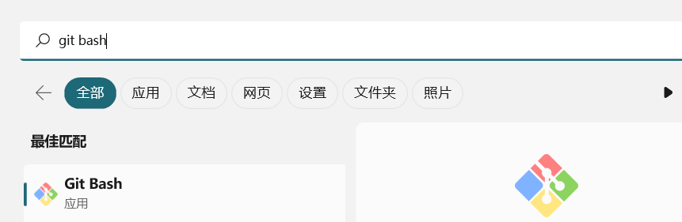

 操作补充 ： 

1. [Git 创建仓库 - Git中文手册 (dba.cn)](https://www.dba.cn/book/git/GITZhongWenShouCe/GITChuangJianCangKu.html)

2. [Hello World - GitHub 文档](https://docs.github.com/zh/get-started/quickstart/hello-world)

### 1、Git准备工作(安装git bash)

#### 为什么选择github？


考虑到以下几点:

1. github 是一个代码托管平台。小组的成员可以一起在这个平台上上传代码。共享自己的代码，并可以上传、下载、合并我们之间的代码。(不知道能不能用先用着)。
2. github 对于以后也是可以长期使用的平台网站。学会 git 的使用可以方便我们查找更多的代码资料。学会一个git项目的版本控制，其他学习也很快。
3. github 网站使用注册方便，资源大多开源快捷。缺点(github 网站服务器在外网。可能连接不稳定)


#### Git 是什么？

git 是一个命令行软件工具，你可以下载，安装，配置git在你的电脑上来使用github。 当然如果你不喜欢使用命令行可以使用图形化界面的github desktop 地址 ->  [GitHub Desktop | Simple collaboration from your desktop](https://desktop.github.com/) 。还有GitHub CLI。我们这里使用gitbash for windows。下载↓↓↓↓↓↓↓↓↓。


#### 开始下载

http://mysysgit.github.io 在windows上安装git。 git就是一个软件。为了方便理解他就是一个没有图形化界面的迅雷下载器，或者是360下载器。只是类似，当然完全不是一个东西。


由于我这里已经下好了，大家可以直接搜一下点击Download。 .exe 安装到一个合适的路径下。**（尽量大的硬盘目录下）**

可以推荐下载点击 **next**.

运行 exe 下载流程： [Git 详细安装教程_gitbash安装教程_高处不胜韩@的博客-CSDN博客](https://blog.csdn.net/hansj123456/article/details/130243459)

### 1.1 安装完成后



启动Git Bash。


### 2. Github && git bash

#### 2.1 注册账号

GitHub官网注册地址：[https://github.com/](https://link.zhihu.com/?target=https%3A//github.com/)


#### 2.2 配置SSH Key

在`GitHub`中配置`SSH Key`的主要作用是为了进行代码仓库的安全认证和访问控制。SSH（Secure Shell）是一种网络协议，可以通过`SSH`密钥对的认证方式来保证通信过程中的安全性。可以使用ssh clone 下载。当然也可以不是ssh key 直接https下载

- 生成生成`SSH`密钥对：在本地计算机上使用`ssh-keygen`命令生成`SSH`密钥对，其中包括公钥和私钥两部分。

```bash
# 生成 SSH 密钥对

ssh-keygen -t rsa -C "your@email.com" （请填你设置的邮箱地址）
```


回车回车就行出现。(上面可以看看公共文件存放在哪)

- 点击头像，`设置 settings`, 单击`SSH and GPG keys`


```bash
# 复制上面公钥地址

cat 公钥地址

```


复制 $ 下面内容

到


#### 2.3 初始化基本的配置

```bash
# 在自己的git bash本地仓库中配置github的用户名称和电子邮件地址
$ git config --global user.name "用户名“
$ git config --global user.email "注册邮件"

# 查看配置信息
git config --list

```

补充: **Git 工作区、暂存区和版本库**， **Git 工作流程** 请查看[Git 创建仓库 - Git中文手册 (dba.cn)](https://www.dba.cn/book/git/GITZhongWenShouCe/GITChuangJianCangKu.html)

理解一下这幅图


哪里看不懂可以群里问。


#### 2.4 克隆任务项目到本地

> 完成上述准备工作，那么就来试验一下。

```bash
# step 1
git clone https://github.com/wlw191/group_SoftwareTest.git

# step 2
ls -a
```


#### 2.5 本地开发(增加)代码进行提交

```bash
# step 1 每一部结果在下方
# 进入到git clone 下的目录下
cd group_SoftwareTest/

# step 2 查看当前仓库中的文件状态
git status

# step 3 将group_name.html 添加到暂存区
git add 

# step 4 将group_name.html 修改并保存。
选择你喜欢的编辑器编辑html文件。(我已经添加内容)
在我的基础上添加
<li><span style="font-weight: bold;">wlw191</span>
      <ul>
        <li>姓名: 姓名拼音简写</li>
        <li>爱好: 爱好书写</li>
      </ul>
    </li>
    
# step 5 查看改动文件状态
git status

# step 6 更新缓存。
git add . 

# step 7 记录缓存区的快照 -m 后提交注释的命令
git commit -m '此次更新创建了一个关于组员的爱好列表的html文件'

# step8 查看当前的远程库的别名()
git remote 
git remote -v
#查看分支
git branch

# step9 我的远程主机名为 origin 
# 如果push 失败可能当前克隆项目没有与远程项目一致 需要执行git pull 同步到本地。
git push <远程主机名> <本地分支名>:<远程分支名>
git push origin main:main

```

- step1


- step2


- step3


- step4


- step5


- step6


- step7


- step8


- step9


### 2.7 小组任务完成结果

跟以上步骤做完，能做到上述图片step9为止。将html文件内容修改


